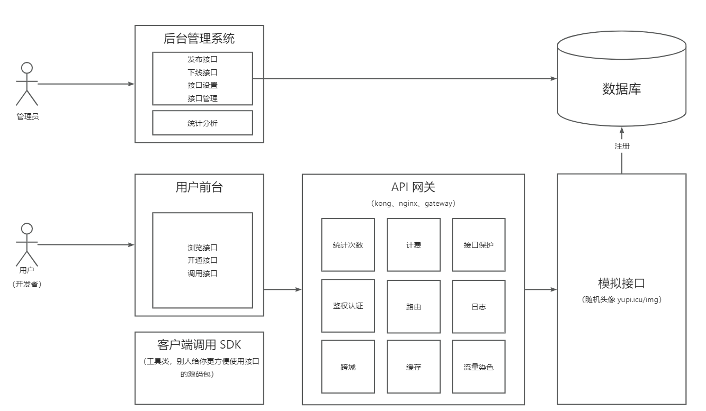

 # openApi

背景：前端开发需要用到后台提供的接口，可以考虑一些第三方接口平台，同时可以自己开发一个公共API接口平台。

目的：完成一个开放API接口平台

## 功能

API接口平台应该具备的功能，参照现有的平台功能，再添加自己需要的内容：

1. 防止攻击（安全性)
2. 不能随便调用(限制、开通)
3. 统计调用次数
4. 计费
5. 流量保护
6. API接入

## 项目介绍

做一个提供API接口调用的平台。

* 用户可以注册登录，开通接口调用权限。
* 用户可以使用接口，并且每次调用会进行统计。
* 管理员可以发布接口、下线接口、接入接口，以及可视化接口的调用情况、数据。

## 业务流程

## 技术选型

### 前端：

* Ant Design Pro
* Ant Design Procompoments
* React
* Umi
* Umi Request (Axios的封装)

### 后端：

* spring boot
* **Spring Boot Starter (SDk开发)**
* 网关、限流、日志实现

## 运行效果

补图 TODO
