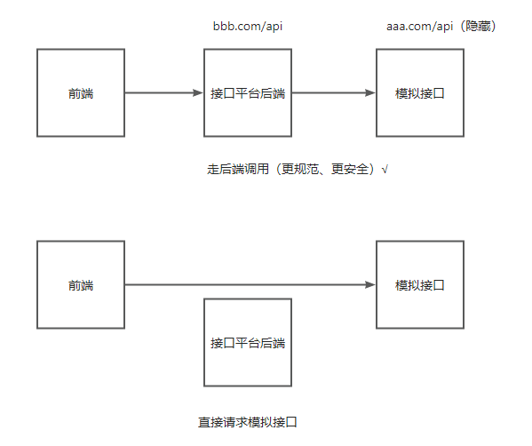
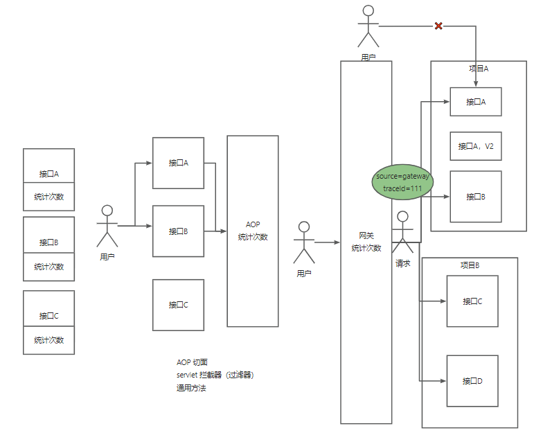

# openapi 需求 + 具体实现

# 项目计划安排

1. 初始化项目
	1. 项目介绍、设计、技术选型
	2. 基础项目搭建（前后端）
	3. 登录页，接口信息页开发
2. 接口调用
	1. 前端接口管理页面开发
	2. 后端模拟API接口开发
	3. 开发调用接口客户端
	4. 客户端 SDK 开发
	5. 客户端 SDK 实现（保证调用的安全性**API 签名认证**；使用Spring Boot Starter）
3. 接口功能开发
    1. 接口发布、下线
	2. 浏览、查看接口文档、申请API签名
	3. 开发在线调试页面（参考其他第三方接口调用平台）
4. 引入网关，统一处理
    1. 统计用户调用接口次数处理
	2. 网关功能（限流、计费、日志、开通）
5. 实现统一接口鉴权和计费 ———— API网关实践
	1. 学习Spring Cloud Gateway
6. 实现统一接口鉴权和计费 ———— RCP,Dubbo学习
	1. 学习Spring Cloud Gateway
7. 整合代码，进行调试
	1. 开发公共服务代码
	2. 实现网关核心逻辑
	3. 开发接口分析功能管理
		* 提供可视化平台，用图表的方展示所有接口的调用情况，便于调整业务
		
# 系统框架

前端：

* 主页
* 查看接口
* 登录
* 管理
	* 接口管理
	* 接口分析

后端：

src						———— 后端服务逻辑
openapi-client-sdk  	———— 利用spring boot starter封装成一个客户端sdk，便于快速进行二次开发
openapi-gateway    		———— 前端请求通过网关，转发到后端实际接口地址，用于解耦，且便于统一处理公共逻辑
openapi-common      	———— 封装公共的模型、接口定义，保证各个子系统使用的一致性。在src后端实现具体逻辑，在gateway中进行调用。
openapi-interface		———— 模拟的接口服务平台

# 项目开发

## 前端项目初始化

利用ant-design Pro脚手架快速搭建一个前端管理系统，用于接口管理系统的呈现

https://pro.ant.design/zh-CN/docs/getting-started/

1. 根据脚手架快速创建项目
```
npm i @ant-design/pro-cli -g
pro create myapp
```

2. 进入项目目录，yarn安装依赖；star:dev 快速启动

3. 项目搜身，小步前进，删除不需要的依赖

```
i18n-remvove     移除国际化
e2e				 删掉e2e测试，删除依赖
test			 删除tests测试
playwright		 删除playwright.config.ts自动测试框架，删除用到他的地方，再删除依赖
```

4. 设置注意点

webstorm Seting里

* ESLint有没有设置为Automatic ESLint configuration
* prettier里面有没有打开On Reformat Code's action

注意事项：

* 根据官方文档，快速选择并使用需要的组件
* 不用太在意React的实现，因为后端同学对前端的掌握程度不是很深，很看懂就行，不要求会写。

### 生成接口方法

ant-design pro 可以根据**openapi 调用后端提供的接口地址，自动生成接口方法。**

### 调用方式



一般采用，通过后端访问模拟接口地址的方式，而不是前端请求直接发送到后端。

## 后端

利用鱼皮的spring-boot-init模板快速启动

### 模板功能

- Spring Boot 2.7.0（贼新）
- Spring MVC
- MySQL 驱动
- MyBatis
- MyBatis Plus
- Spring Session Redis 分布式登录
- Spring AOP
- Apache Commons Lang3 工具类
- Lombok 注解
- Swagger + Knife4j 接口文档
- Spring Boot 调试工具和项目处理器
- 全局请求响应拦截器（记录日志）
- 全局异常处理器
- 自定义错误码
- 封装通用响应类
- 示例用户注册、登录、搜索功能
- 示例单元测试类
- 示例 SQL（用户表）

库表设计时，可以使用[sqlfater](https://www.sqlfather.com/)  快速开发。

如果不确定需要哪些字段可以参考一下别人做的类似网站(接口调用平台，例如，腾讯、阿里)；或看一下接口请求需要哪些内容，通过开发者模式看

一般表结构会包含如下字段，id、创建时间、修改时间、逻辑删除字段等。

```sql
create table if not exists info
(
    id           bigint auto_increment comment 'id' primary key,
    createTime   datetime     default CURRENT_TIMESTAMP not null comment '创建时间',
    updateTime   datetime     default CURRENT_TIMESTAMP not null on update CURRENT_TIMESTAMP comment '更新时间',
    isDelete     tinyint      default 0                 not null comment '是否删除',
) comment '信息';
```

### 需求

1. 管理员可以对接口信息进行增删改查
2. 用户可以访问前台，查看接口信息
3. 创建openapi-interface 用于模拟接口
	* 如何保证接口不被随意调用，分发签名，只有拿到签名才能调用
	


# 接口调用次数统计

需求：

1. 用户每次调用接口成功，次数+1
2. 给用户分配或者用户自主申请调用次数

业务流程：

1. 用户调用接口（之前已完成）
2. 修改数据库，调用次数+1

问题：

如果每个接口的方法都各自实现调用次数 + 1 ，是不是比较麻烦？

致命问题：逻辑耦合，不能由接口开发者各自添加统计的代码，而是应该统一处理



分析优缺点：

* AOP切面
	* 优点：独立于接口，在每个接口调用后统计次数+1
	* 缺点：只存在于单个项目中，如果每个团队都要开发自己的模拟接口，那么都要写一个切面
* servlet拦截器
* 网关(选择使用网关来统一处理)


* 注重思想，设计，代码的话多写即可。
* 请求级别鉴权  ———— http request
* 会话级别鉴权  ———— session中获取

# 项目测试

1. 打包 openapi-client-sdk、openapi-common （提供src,gateway使用）
2. 刷新各个子系统的pom文件依赖
3. 后端运行
	1. 先启动windows上的nacos服务器 (8848)，命令`startup.cmd -m standalone`  (https://blog.csdn.net/doinbb/article/details/103504803)
		* 删除报错信息中的’/data/nacos/data/derby-data’目录，重新启动。
	2. 启动 src(backend)           7529
	3. 再启动 openapi-gateway      8090
	4. 最后启动 openapi-interface  8123
3. 运行测试：模拟接口 `http://localhost:8123/api/name/get?name=kkk` 
    * 直接访问的是openapi-interface项目，界面返回 `GET 你的名字是kkk` 表示成功
   运行测试：网关功能 `http://127.0.0.1:8090/api/name/get?name=kkk` 
    * 直接访问的是openapi-gateway项目，界面返回 HTTP ERROR 403
    * 需要从前端界面来访问, 因为直接访问http请求消息头里的信息无法进行 API签名认证
4. 整体流程测试：
    
	
      * 前端
		* 前端（8000）将/invoke请求发送到后端（7529）:；
			* frontend/config/config.ts 配置了openAPI(http://localhost:7529/api/v3/api-docs),后端文档地址，**可以直接生成需要调用的结构和方法**
		* 后端(集成了sdk)转向调用 openapi-client-sdk 提供的 getUsernameByPost方法; 
		* getUsernameByPost方法将请求发送到网关（8090） (由openapi-client-sdk里面配置了网关地址)
		* 网关通过路由转发规则将实际请求发生到后台模拟地址（8123），完成接口的调用，最终返回给前端。
      * 各个服务的端口地址：
	    * 前端 ：8000
        * openapi-interface ：模拟接口  8123
		* openapi-gateway：网关   8090，转发请求到8123
		* src：后端服务器   7529
