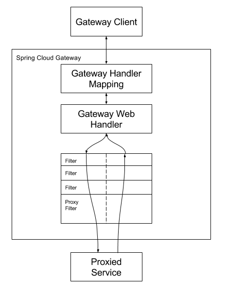

# openApi —— 网关

# 概念

什么是网关？理解成火车站的检票口，**统一** 检票

**优点**： 统一进行操作，去处理一些共性问题

# 作用

1. 路由
2. 负载均衡
3. 统一鉴权
4. 统一处理跨域
5. 统一业务处理（缓存）
6. 访问控制
7. 发布控制
8. 流量染色
9. 统一接口保护
   1. 限制请求
   2. 信息脱敏
   3. 降级（熔断）
   4. 限流 **学习令牌桶算法，学习漏桶算法（todo）**，学习一下RedislimitHandler
   5. 超时时间
   6. 重试（业务保护）
10. 统一日志
11. 统一文档

## 路由

起到转发的作用，比如，存在接口A和接口B，网关会记录这些信息，根据用户访问的地址和参数，转发请求到对应的接口（服务器/集群）

* /a=>接口A
* /b=>接口B

https://docs.spring.io/spring-cloud-gateway/docs/current/reference/html/#gateway-request-predicates-factories

## 负载均衡

在路由的基础上可以转发到集群中某一个服务器。

* /c => 服务A/ 集群A（随机转发到其中的某一个机器）

uri从固定地址改成lb:xx  ———— 即负载均衡的机器进行分发

## 统一处理跨域

统一处理跨域问题，不需要在每个项目单独处理

https://docs.spring.io/spring-cloud-gateway/docs/current/reference/html/#cors-configuration

## 发布控制

灰度发布，比如上线新接口，先给新接口分配20%流量，老接口80% ,再慢慢调整比例，最终完成新老接口切换。

https://docs.spring.io/spring-cloud-gateway/docs/current/reference/html/#the-weight-route-predicate-factory

## 流量染色

区分用户来源（todo）,给请求（流量）添加一些标识，一般是设置请求头中，添加新的请求头

https://docs.spring.io/spring-cloud-gateway/docs/current/reference/html/#the-addrequestheader-gatewayfilter-factory

**全局染色**：https://docs.spring.io/spring-cloud-gateway/docs/current/reference/html/#default-filters

## 接口保护

1. 限制请求

   https://docs.spring.io/spring-cloud-gateway/docs/current/reference/html/#requestheadersiz-gatewayfilter-factory

2. 信息脱敏 

   https://docs.spring.io/spring-cloud-gateway/docs/current/reference/html/#the-removerequestheader-gatewayfilter-factory

3. 降级（熔断） 

   https://docs.spring.io/spring-cloud-gateway/docs/current/reference/html/#fallback-headers

4. 限流   

   https://docs.spring.io/spring-cloud-gateway/docs/current/reference/html/#the-requestratelimiter-gatewayfilter-factory

5. 超时时间

   https://docs.spring.io/spring-cloud-gateway/docs/current/reference/html/#http-timeouts-configuration 

6. 重试（业务保护）：

   https://docs.spring.io/spring-cloud-gateway/docs/current/reference/html/#the-retry-gatewayfilter-factory

## 统一业务处理

把每个项目中都要做的通用逻辑放到上层（网关），统一处理，比如,本项目需要做的**接口调用次数统计**

## 统一鉴权

判断用户是否有权限进行操作，无论访问什么接口，可以统一去判断权限，不用重复写。

## 访问控制

黑白名单，比如限制ddos ip

## 统一日志

统一的请求，响应信息记录，便于追踪定位问题

## 统一文档

将下游项目的文档进行聚合，在一个页面统一查看

建议用：https://doc.xiaominfo.com/docs/middleware-sources/,aggregation-introduction

## 网关的分类

1. **全局网关（接入层网关)**：作用是负载均衡、请求日志等，不和业务逻辑绑定

2. **业务网关（微服务网关）**：会有一些业务逻辑，作用是将请求转发到不同的业务/项目/接口/服务

参考文章：https://blog.csdn.net/qq21040559/article/details/122961395

## 实现

1. **Nginx** （全局网关），**Kong网关**（API网关），  **编程成本相对较高**
2. **Spring Cloud Gateway**（取代了Zuul）性能高 可以用**java**代码来写逻辑  适于学习
  
网关技术选型：https://zhuanlan.zhihu.com/p/500587132

## Spring Cloud Gateway用法

官网：https://spring.io/projects/spring-cloud-gateway

官方文档：https://docs.spring.io/spring-cloud-gateway/docs/current/reference/html/

### 核心概念

1. 路由（根据什么条件，转发到哪里）
2. 断言（一组规则，条件，用来确定如何转发路由）
3. 过滤器：对请求进行一系列的处理，比如添加请求头，添加请求参数

请求流程：
   

### 两种配置方式

1. 配置式 （方便，规范）能用就用
   1. 简化版
   2. 全称
2. 编程式 （灵活，相对麻烦）

### 使用示例

application-gateway.yml